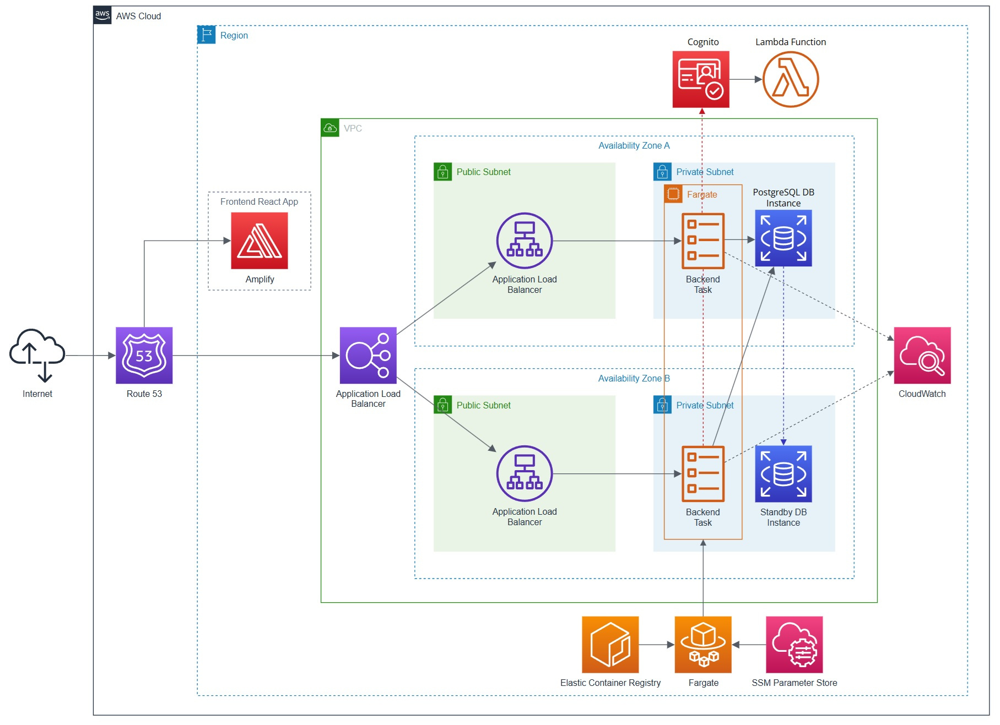

## 🏆 Award-Winning Capstone

DanceDesk earned multiple awards at the **Durham College IT Student Expo 2025**

🥇 **Best In Show** (tied)
🥇 **Best In Class** (tied)
🏅 **Best Booth**

## What is DanceDesk?

Dance studios are businesses and like any other business, managing them can be complex. After surveying 18 studio owners across Canada, we found that **72% were still using spreadsheets or pen and paper** to build and track their schedules, and **61% were spending 4 to 12+ hours a month** on scheduling admin alone. Furthermore, administrative data was generally fragmented across spreadsheets, notebooks, emails and text messages to name a few sources. This makes it difficult to get a clear picture of studio operations.

The time spent on administrative tasks and the fragmented data creates a number of problems for dance studios. It comes out of teacher planning, student attention, and the work that actually grows a studio. It shows up as last-minute changes that frustrate parents, conflicts that disrupt dancer progress, empty rooms that could have been booked, and underutilized staff that cut into margins.

DanceDesk was built to address that directly. One of our core goals going into this project was to create something that directly addresses a business problem. Software afterall is really just a means to an end for useful work to be done. We spent a lot of time on the problem before writing a line of code. The survey results told us where the pain was and the platform we built was a direct response to that.

I served as the **backend developer and cloud architect** on our capstone team, and made many contributions to the frontend as the deadline approached. On the backend I designed and built the RESTful API, handling everything from authentication to a scheduling engine that enforces real-time conflict detection. On the frontend I wired up authentication and token refresh, built out the conflict detection scheduling UI, and put in significant work on styling and overall polish in the final sprint to get the product over the finish line. This repository captures the MVP backend that proved out the architecture and core functionality. This was the foundation that was iterated upon to present at the IT Student Expo.

Read more about the project on [LinkedIn](https://www.linkedin.com/posts/colin-eade_three-years-of-studies-and-a-demanding-final-activity-7315047905411706881-9pvH).

## System Architecture

The IT Expo deployment ran entirely on AWS, built around containerized services, managed infrastructure, and the AWS Well-Architected Framework. The diagram below illustrates how the pieces fit together:

### Shown in Diagram:

- **Route 53** — The internet's address book for DanceDesk. When someone types the domain name, Route 53 directs them to the frontend website. From there, the app communicates with the backend API behind the scenes as users interact with it.
- **Amplify** — Hosts the frontend website that end users interact with.
- **Application Load Balancer** — Acts as a traffic director in front of the backend API. Every incoming request passes through here, and it distributes the load across healthy backend servers — if one has a problem, it's automatically skipped.
- **ECS with Fargate** — Runs the backend application across two separate AWS data centers simultaneously. If one goes down, the other keeps serving traffic without any manual intervention.
- **ECR** — A private storage location for the packaged-up backend application. When a new backend server starts, it pulls the latest version of the app from here.
- **SSM Parameter Store** — A secure vault for sensitive configuration like database passwords and API keys. Secrets stay out of the codebase and are delivered safely to each backend instance at startup.
- **RDS PostgreSQL** — The production database where all studio data lives: schedules, members, rooms, classes. A standby copy runs in a second data center and takes over automatically if the primary fails.
- **Cognito** — Handles all user accounts and logins. After signing in, a user receives a secure digital credential that gets attached to every request they make.
- **CloudWatch** — Collects logs from every running backend instance. A continuous record of what the application is doing, which makes diagnosing problems possible after they happen.

### Not Shown in Diagram:

- **Security Groups** — Firewall rules that control which services are allowed to talk to each other. The load balancer accepts traffic from the internet, but Fargate only accepts traffic from the load balancer, and RDS only accepts traffic from Fargate. Nothing reaches the database directly from outside.
- **CI/CD Pipeline (GitHub Actions + CodeBuild)** — Every push to `main` triggers an automated deployment. The pipeline pulls the database connection string from SSM, runs any pending database migrations against the production database, builds a new Docker image tagged with the commit ID, pushes it to ECR, updates the ECS task definition to point at the new image, and deploys it. The deployment waits until the new backend instances pass their health checks before completing.

## Engineering Highlights

### Scheduling with Conflict Detection

A dance studio can't have two classes in the same room at the same time, and a teacher or dancer can't be in two places at once. These constraints need to be enforced server-side, not just at the UI layer.

The scheduling service checks four dimensions before any class is created or updated: rooms, teachers, dancers, and routines. Each dimension produces a structured `ConflictGroup` with enough detail to tell the client _exactly_ what's clashing and why. For example, a room conflict response will name the conflicting class, the day, and the overlapping time window. All scheduling writes run inside database transactions so concurrent requests can't slip through the checks.

### Multi-Tenant Data Isolation

The platform supports multiple dance studio organizations, and no studio should ever see another studio's data, whether through a bug, a crafted request, or a missing filter.

Every authenticated request carries the user's `organizationId`, extracted from their JWT by the auth middleware. Services enforce tenant scoping at the query level, so every database operation filters by `organizationId` before anything else. There's no endpoint where a client can supply their own org ID; it always comes from the verified token.

### Automated CI/CD Pipeline

A few design decisions in this pipeline are worth calling out. The runner is a self-hosted AWS CodeBuild instance rather than a GitHub-hosted runner. This means the pipeline authenticates to AWS through IAM roles rather than stored secrets, which keeps credentials out of GitHub entirely. Database migrations run before the new image is built and deployed, ensuring the schema is updated before any new code that depends on it goes live. Finally, the deployment step waits for ECS to report service stability before the workflow completes. If the new instances fail their health checks, the rollout is blocked and the previous version stays in service.

### Structured Error Handling

The API uses a custom error hierarchy built on an abstract `AppError` class. Each error type maps to a specific HTTP status code and produces a consistent JSON response shape. Validation errors (via Zod) carry per-field detail arrays. Scheduling conflicts carry full `ConflictGroup` breakdowns with the specific resources and overlap details. A global error handler middleware catches every thrown error, maps it through dedicated error mappers, and returns the standardized envelope. Stack traces only appear in development mode.

## Tech Stack

| Layer            | Technologies                                         |
| ---------------- | ---------------------------------------------------- |
| **Runtime**      | Node.js 20, TypeScript (strict mode)                 |
| **Framework**    | Express.js 4                                         |
| **Database**     | PostgreSQL 17, Prisma ORM 6                          |
| **Auth**         | AWS Cognito, JWT (aws-jwt-verify)                    |
| **Validation**   | Zod                                                  |
| **Logging**      | Pino, pino-http                                      |
| **DevOps**       | Docker, GitHub Actions, AWS CodeBuild                |
| **Cloud**        | ECS Fargate, RDS, ECR, ALB, Route 53, Cognito        |
| **Code Quality** | ESLint 9 (flat config), Prettier, Husky, lint-staged |

## My Role

I was the sole backend developer and cloud architect on the team, and stepped into frontend work wherever it was needed. Here's what I owned:

**Backend & Infrastructure**

- Designed and built the complete RESTful API, defining the routing, controllers, services, and data access layers
- Modeled the PostgreSQL schema in Prisma, wrote all migrations, and managed seed data throughout development
- Built the scheduling engine and its conflict detection system from scratch
- Integrated AWS Cognito for user identity management and implemented JWT-based route protection with role-based access control
- Set up and managed the full AWS cloud environment, including ECS, RDS, ECR, ALB, Cognito, Route 53, and IAM
- Designed the CI/CD pipeline using GitHub Actions with CodeBuild self-hosted runners for automated build, migration, and deployment
- Established the team's local development environment with Dockerized PostgreSQL and pgAdmin

**Frontend Contributions**

- Wired up authentication on the React frontend and implemented automatic token refresh so sessions stay valid without requiring the user to log in again
- Built out the conflict detection and scheduling UI, connecting it to the backend's structured conflict responses so clashes surface clearly in the interface
- Contributed significant styling work to bring the UI to a clean, functional state for the expo
- Stepped in heavily during the final sprint to help pull everything together before the semester deadline

## Reflections

**Domain understanding before code.** The scheduling logic seemed straightforward until we dug into edge cases: overlapping time ranges, multi-resource conflicts, recurring events that span season boundaries. Spending time mapping the actual business rules before writing code saved significant rework later.

**Estimation is harder than it looks.** Features that seem like "just CRUD" can hide surprising complexity when they intersect with scheduling rules and transactional integrity. I consistently underestimated these at first, and got better at flagging that uncertainty early instead of committing to deadlines I couldn't keep.

**Clear team boundaries matter.** As the sole backend developer working alongside frontend developers, having clear API contracts and open communication about what was ready (and what wasn't) was the difference between smooth integration and blocked features.

---

> **About this repository:** This project was developed as an academic capstone and relies on AWS services and environment configurations that are not included here. The code is provided for review of its architecture, patterns, and engineering decisions, not as a turnkey deployment. Some identifiers and configurations have been generalized for this public presentation.
